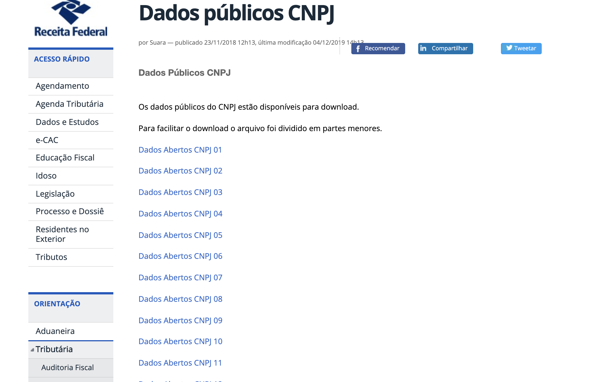
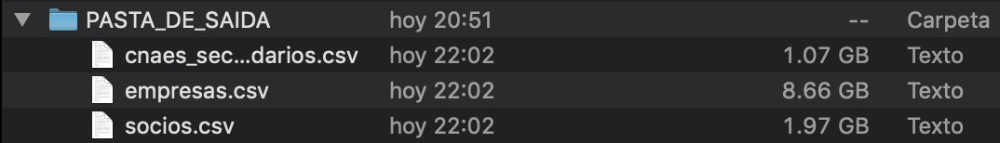
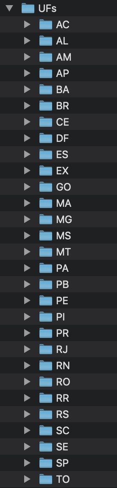
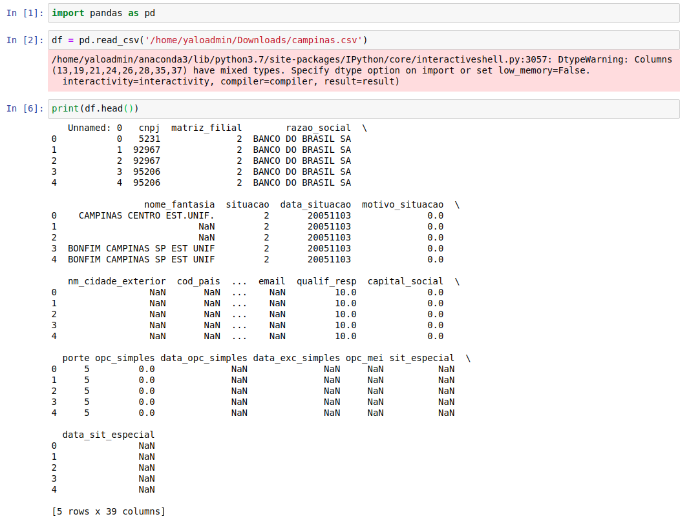

# CNPJ Data Brazil

1. Fork and Clone (Local) the following repository [CNPJ](https://github.com/fabioserpa/CNPJ-full)
2. Download every file from [Link](http://receita.economia.gov.br/orientacao/tributaria/cadastros/cadastro-nacional-de-pessoas-juridicas-cnpj/dados-publicos-cnpj) and save into a file named PASTA_COM_ZIPS

## 3. Run the following in terminal

    $ python3 -m pip install --upgrade pip

## 4. Install the prerequisites, run the following in terminal

    $ pip install -r requirements.txt

## 5. Execute the following in terminal

    python3 [cnpj.py](http://cnpj.py/) PASTA_COM_ZIPS csv PASTA_DE_SAIDA --dir

## 6. Wait until the data is being transformed and saved into PASTA_DE_SAIDA

## 7. For separating into Cities

    python3 -m pip install python-dotenv

## 8. Open the file **separar_csv_por_cidade.py** and define **location** as the path to the file  **'empresas.csv'**

    location = '/Users/diegofrade/Documents/GitHub/CNPJ-full/PASTA_DE_SAIDA/'

## 9. Go to terminal and run and wait for some hours because it is a really large file and complex cleansing process.

    python3 separar_csv_por_cidade.py

## 10. Now all the information is classified in folders containing the province and in these folders there are many csv files containing information grouped by city.

## 11.  Now after naming each column we can explore the data using jupyter notebook.

## 12. These are the available variables with their possible values:

1. **cnpj**

    a. cnpj codes id

2. **matriz_filial**

    a. number 1 and 2

3. **razao_social**

    a. business name

4. **nome_fantasia**

    a. different names

5. **situacao**

    a. [ 2 8 4 3 1 20151216 20160502 20181218]

6. **data_situacao**

    a. date

7. **motivo_situacao**

    a. 

        [ 0.  1. 71. 63. 54. 73. 18. 21.  2.  9. 61.  7. 34. 14. 11. 74. 64.  6.
         39. 10. 17. 31. 15.  5. 72.  4. 36. 67. 16. 41. 37. 70. 62. nan  3.  8.
         38.]

8. **nm_cidade_exterior**

    a. NaN

9. **cod_pais**

    a. NaN

10. **nome_pais**

    a. [ nan 2135.]

11. **cod_nat_juridica**

    a. 

        [    2038     2062     2135     2240     2305     2054     2070     4014
             2143     2100     3220     3999     3085     3131     3069     2046
             2313     2321     8885     2232     3301     2011     3034     2127
             1015     1074     1252     2178     3271     2151     1023     1155
             2259     3077     1104     5029     4090     1210     1139     3115
             1120     1112     4120     1333     1325     3204     2097     3298
         20151216 20160502     1163     1228     1031     2160     1147     2089
             1066     1082     1244     3255 19870908     2224]

12. **data_inicio_ativ**

    a. date beginning activities

13. **cnae_fiscal**

    a. id

14. **tipo_logradouro**

    a. 

        ['RUA' 'AVENIDA' nan 'AEROPORTO' 'RODOVIA' 'ESTRADA' 'VIA' 'PRACA' 'LARGO'
         'ALAMEDA' 'TREVO' 'FAZENDA' 'TRAVESSA' 'VILA' 'ACESSO'
         'ESTRADA MUNICIPAL' 'CHACARA' 'COLONIA' 'SITIO' 'PRAÇA' 'MERCADO'
         'QUADRA' 'RUA DE LIGACAO' 'VIADUTO' 'CAMPO' 'RUA DE PEDESTRE' 'CAMINHO'
         'VIELA' '9A RUA' 'RUA PRINCIPAL' 'PARQUE' 'CHÁCARA' 'LOTEAMENTO' 'OUTROS'
         'RESIDENCIAL' 'SÍTIO' 'CONDOMINIO' 'CONDOMÍNIO' 'RUA DE LIGAÇÃO'
         'DISTRITO' 'ÁREA' 'GALERIA' 'AREA' 'RUELA' 'MARGEM' 'ESTRADA VELHA'
         'TERMINAL' '3A RUA' 'PASSAGEM' '8A RUA' 'CAMINHO DE SERVIDAO'
         'ENTRADA PARTICULAR' 'COND. RESIDENCIAL' 'ESTÂNCIA' 'SERVIDÃO'
         'AVENIDA MARGINAL' '7A RUA' 'ESTRADA VICINAL' '10A RUA' '1A AVENIDA'
         'ROTATORIA' 'ESTACAO' '9A TRAVESSA' 'BLOCO' 'JOSE SORIANO DE SOUSA FILHO'
         'JACY TEIXEIRA CAMARGO' 'SERVIDAO' 'ROTULA' 'RUA VELHA' 'UNIDADE'
         'RUA PROJETADA' 'RAMAL' 'JARDIM' 'CONJUNTO' 'RECANTO' 'SETOR' 'NUCLEO'
         'BENEDITO JOSE DO CARMO']

15. **logradouro**

    a. name

16. **numero**

    a. number

17. **complemento**

    a. string value

18. **bairro**

    a. neighborhood

19. **cep**

    a. id

20. **uf**

    a. ['SP' '6291']

21. **cod_municipio**

    a. id

22. **municipio**

    a. String value

23. **ddd_1**

    a. 

        [          nan 1.9000000e+01 1.1000000e+01 1.7000000e+01 3.1000000e+01
         6.1000000e+01 1.9200000e+02 1.3000000e+01 4.1000000e+01 2.1000000e+01
         1.6000000e+01 2.7000000e+01 1.8000000e+01 1.5000000e+01 1.4000000e+01
         1.2000000e+01 3.5000000e+01 3.2000000e+01 9.9000000e+01 4.3000000e+01
         3.4000000e+01 4.7000000e+01 6.5000000e+01 1.0000000e+00 7.1000000e+01
         2.4000000e+01 5.1000000e+01 9.2000000e+01 1.9300000e+02 4.4000000e+01
         2.2000000e+01 6.2000000e+01 4.9000000e+01 1.1600000e+02 9.0000000e+00
         3.8000000e+01 1.9700000e+02 5.4000000e+01 9.1000000e+01 8.8000000e+01
         1.9320000e+03 4.1900000e+02 4.8000000e+01 8.1000000e+01 1.0900000e+02
         4.2000000e+01 1.0000000e+01 8.5000000e+01 0.0000000e+00 3.0000000e+01
         6.7000000e+01 8.4000000e+01 9.3000000e+01 4.5000000e+01 2.9000000e+01
         8.7000000e+01 7.3000000e+01 3.3000000e+01 3.9000000e+01 3.6000000e+01
         6.3000000e+01 9.6000000e+01 5.9000000e+01 8.9000000e+01 9.8000000e+01
         6.6000000e+01 7.7000000e+01 6.8000000e+01 8.3000000e+01 7.4000000e+01
         9.4000000e+01 5.3000000e+01 3.7000000e+01 6.9000000e+01 7.5000000e+01
         5.5000000e+01 2.8000000e+01 7.9000000e+01 6.4000000e+01 8.2000000e+01
         9.5000000e+01 7.6000000e+01 4.6000000e+01 8.8267255e+07 8.1311738e+07
         8.6000000e+01 9.7000000e+01 7.0000000e+00 6.5770000e+03 1.6200000e+02
         1.1800000e+02 3.2760000e+03 1.9400000e+02]

24. **telefone_1**

    a. number 

25. **ddd_2**

    a. 

        [nan 19. 11. 15. 18. 13. 41. 47. 27. 16. 61. 34. 71. 51. 35. 24. 92. 14.
         22. 69. 62. 21. 31. 17. 12. 32. 28. 48. 65. 29. 10. 85. 43. 81.  1. 37.
          0. 97. 49. 30. 55. 38. 99. 78. 98. 96. 44. 33. 26. 58. 87. 36. 89. 45.
         63. 93. 74. 86. 68. 59. 53. 91. 54.]

26. **telefone_2**

    a. number

27. **ddd_fax**

    a. number

28. **num_fax**

    a. number 

29. **email**

    a. email

30. **qualif_resp**

    a. 

        [1.0e+01 4.9e+01 5.0e+01 5.0e+00 6.5e+01 1.6e+01 3.4e+01 2.3e+01 2.8e+01
         1.9e+01 6.4e+01 1.2e+01 1.3e+01 0.0e+00 4.2e+01 3.1e+01 3.6e+01 1.7e+01
         4.0e+01 5.1e+01 3.2e+01 5.9e+01 6.0e+01 1.0e+04 5.0e+05 1.1e+01 4.3e+01
         2.4e+01]

31. **capital_social**

    a. number 

32. **porte**

    a. [5 1 3 0]

33. **opc_simples**

    a. 

        [0.0000000e+00 7.0000000e+00 8.0000000e+00 5.0000000e+00 6.0000000e+00
         2.0151216e+07 2.0160502e+07           nan]

34. **data_opc_simples**

    a. number

35. **data_exc_simples**

    a. number 

36. **opc_mei**

    a. [nan 'N' 'S']

37. **sit_especial**

    a. 

        [nan 'DECRETACAO DE FALENCIA' 'ESPOLIO EV 407' 'INICIO DE INTERVENCAO'
         'INICIO LIQ EXTRA JUD' 'INICIO DE LIQUIDACAO' 'INICIO DE LIQ JUDICIAL']

38. **data_sit_especial**

    a. number 

13. Most files are very large so in my opinion we should experiment with a smaller city like Campinas in the SP province and then apply that code to other larger files. 

14. This information is only for Campinas, columns won't change but rows will have different values depending on the city and province chosen.
